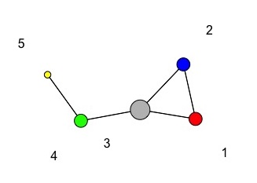
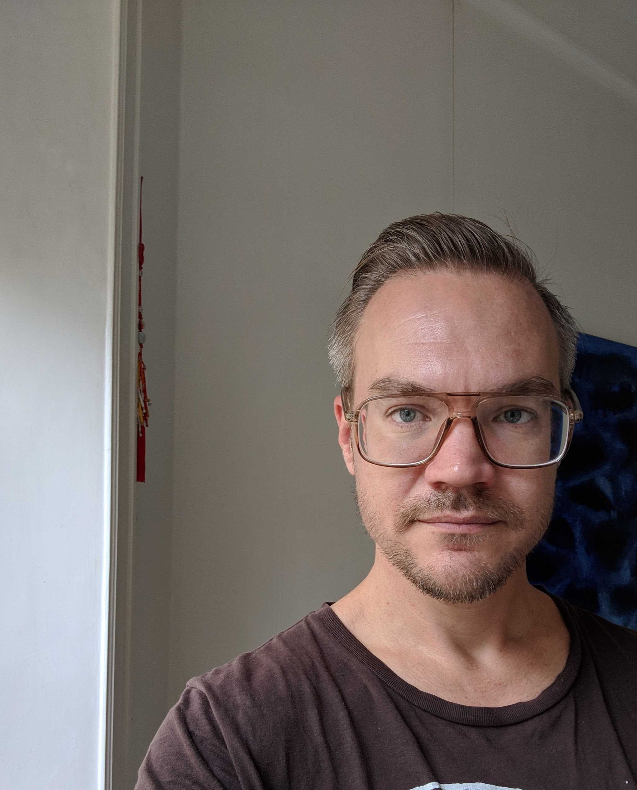

# SunbeltXVLALAAM
<!-- PROJECT LOGO -->
<br />
<div align="center">
  <a href="https://github.com/johankoskinen/CHDH-SNA">
      
   </a>

  <h3 align="center">Sunbelt Paris - ALAAM workshop</h3>

  <p align="center">
    This is material for the ALAAM workshop at Sciences Po (Room 1ST-C.S26), Monday 23 June.
    <br />
    <a href="https://github.com/johankoskinen/SunbeltXVLALAAM/tree/main/Markdowns"><strong>Explore the R-code »</strong></a>
    <br />
     <a href="https://github.com/johankoskinen/SunbeltXVLALAAM/tree/main/Slides"><strong>Explore the Teaching material »</strong></a>
    <br />
    <a href="https://github.com/johankoskinen/SunbeltXVLALAAM/issues">Report Bug</a>
    ·
    <a href="https://github.com/johankoskinen/SunbeltXVLALAAM/issues">Request Feature</a>
  </p>
</div>


<!-- OVERVIEW -->
## Overview of the workshop

The workshop is built around a set of slides and a two RMarkdown files, with accompanying data sets, that you will find here. The goal is to take you through the estimation approach of 

<p align="right">(<a href="#readme-top">back to top</a>)</p>


<!-- GETTING STARTED -->
## Getting Started


### Context

By network data, we will assume data where we have observations on binary tie-variables among a fixed set of nodes. In a typical dataset, network ties will be elicited through name-generators,[[1]](#1) such as

> Anongs the people in your organisation, list the people that you go to for advice

There are many other ways in which to collect and `operationalise' network ties. Here we will not deal with network inference such as inferring causal graphs or other network represenations

<p align="right">(<a href="#readme-top">back to top</a>)</p>

The ALAAM routines are not yet in an R package but stored  in the main ALAAM repositiory [https://raw.githubusercontent.com/johankoskinen/ALAAM).

### R-Prerequisites

There are plenty of tutorials and introductions to network analysis in R and we refer, for example to Borgatti et al (2022)[[2]](#2) for a comprehensive treatment (see also the accompanyhing online supplementary material)

No particular R-skills are expected. You should be able to download the RMarkdown files and run them locally. The RMarkdown files will read any data straight from [https://raw.githubusercontent.com/johankoskinen/) or other online repositories.

No fancy R-wrappers will be used and the code is written entirely in base R and [Quick-R](https://www.statmethods.net/)
should be a sufficient source of help outside of Googling package specific issues. For the SAOM part of the workshop (sessions 2-4) the repository 
[https://www.stats.ox.ac.uk/~snijders/siena/](https://www.stats.ox.ac.uk/~snijders/siena/) contains all the resources you will ever need.

You *will*, however, need to come with a laptop with R and R-studio installed. In addition, you will want to install the packages
* sna
  ```sh
  install.packages(sna)
* network
  ```sh
  install.packages(network)  
  
* balaam
  ```sh
  source("https://raw.githubusercontent.com/johankoskinen/ALAAM/main/balaam.R")
  
 If you need to update your version of R, a handy guide is provided [here](https://www.linkedin.com/pulse/3-methods-update-r-rstudio-windows-mac-woratana-ngarmtrakulchol) 


<p align="right">(<a href="#readme-top">back to top</a>)</p>

<!-- ROADMAP -->
## Roadmap

- [x] Install <a href="https://cran.r-project.org/"></a> (R version 4.2.1 (2022-06-23) may be required)
- [x] Install <a href="https://posit.co/download/rstudio-desktop/"></a>
- [ ] Download `ALAAM-INSNA-XVL.Rmd`
- [ ] Explore RMarkdown by
    - [ ] Stepping through code
    - [ ] Knit to html or pdf for future reference
- [ ] Consult slide pack

<p align="right">(<a href="#readme-top">back to top</a>)</p>


<!-- CONTACT -->
## Contact



Johan Koskinen - [@drjohankoskinen](https://twitter.com/drjohankoskinen) - johan.koskinen@stat.su.se

Project Link: [https://github.com/johankoskinen/CDHD-SNA](https://github.com/johankoskinen/ALAAM)

<p align="right">(<a href="#readme-top">back to top</a>)</p>

## References
<a id="1">[1]</a> 
Robins, G. (2015).
Doing Social Networks Research: Network Research Design for Social Scientists.
Los Angeles: Sage.

<a id="2">[2]</a> 
Borgatti, S. P., Everett, M. G., Johnson, J. C., & Agneessens, F. (2022).
Analyzing Social Networks Using R.
Sage.

<a id="2">[3]</a> 
Koskinen, J, & Daraganova, G. (2022).
Bayesian analysis of social influence.
Journal of the Royal Statistical Society Series A.
185: 1855-1881.
